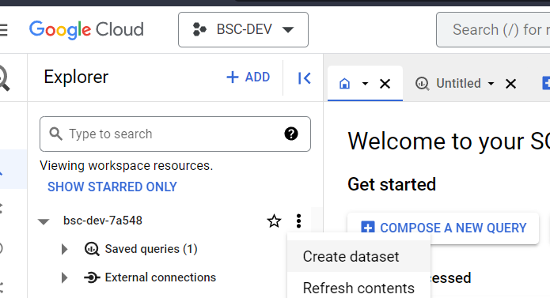
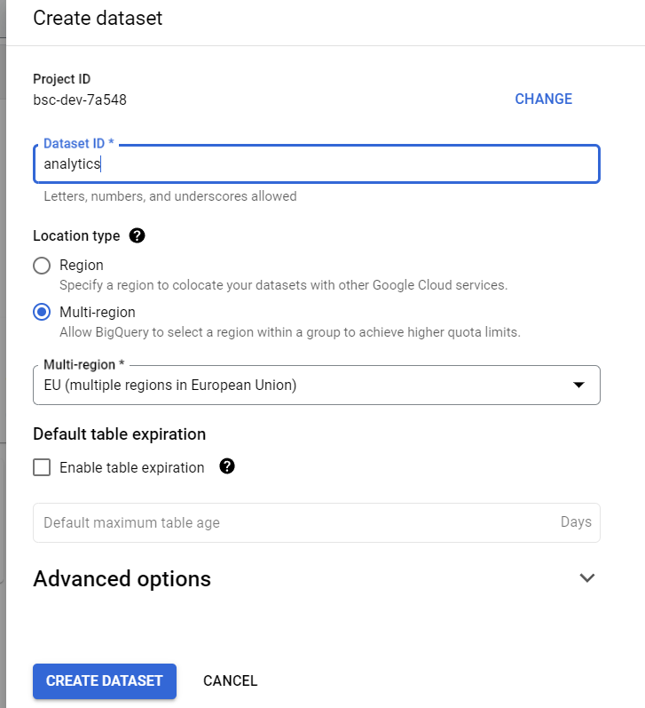
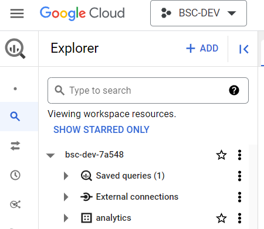
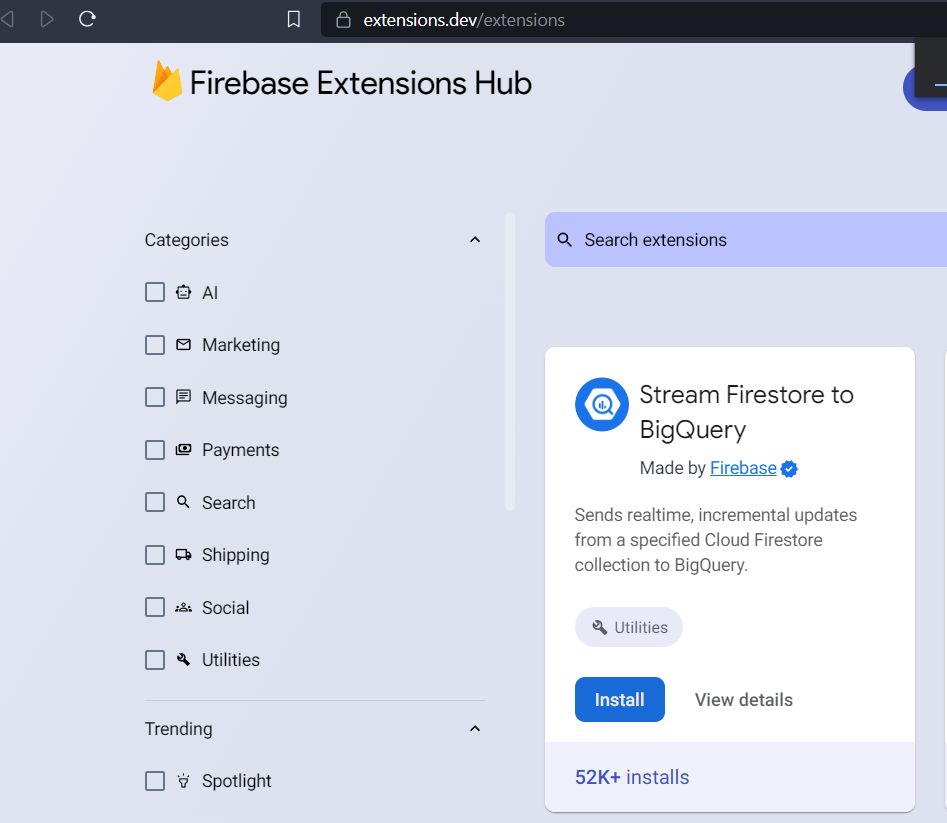
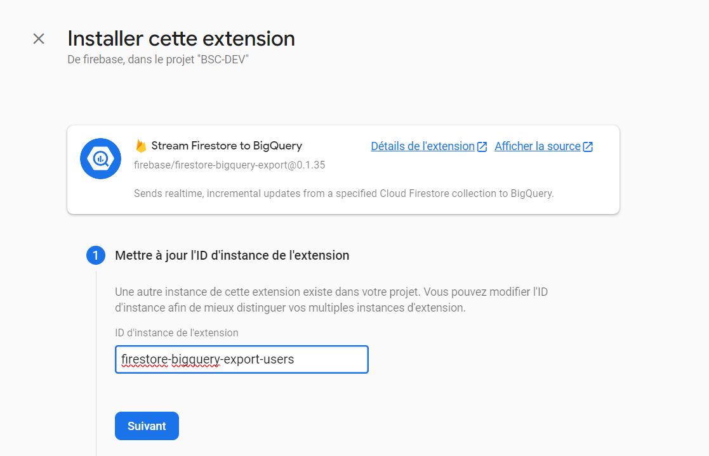
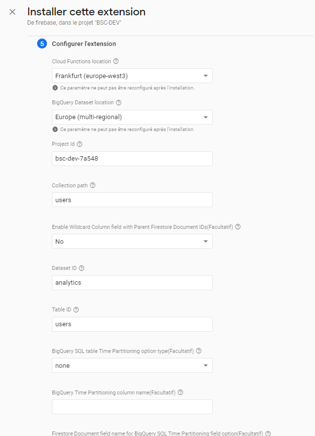
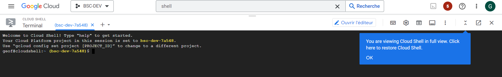
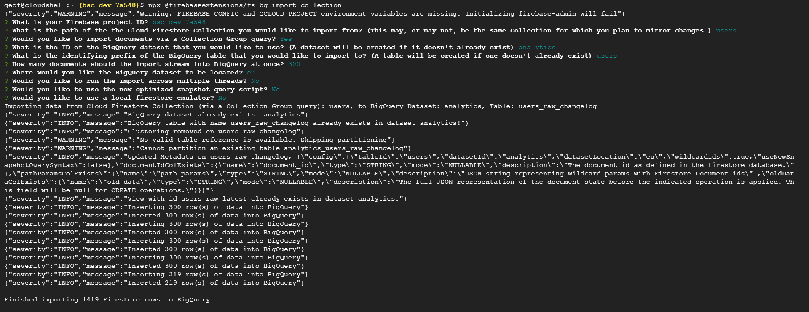

| **Data Warehouse setup**  **Documentation** |
|---------------------------------------------|

1. BigQuery database creation
=============================

-   Go to cloud console - BigQuery service

-   create a dataset “analytics” in EU region

2. Firestore streaming setup
============================

-   Go to cloud console - Firebase extension

-   Install extension “Stream firestore to bigquery”

-   Select the environment / project

-   Install the extension with following parameters and naming convention

Add the collection name at the end of the extension to recognize the stream
(example with “users” collection)

Configure the extension with EU settings, project ID of the environment and
collection from FIrestore

List of streams setup

[./media/image9.png](./media/image9.png)
========================================

For each collection, the install operation needs to be completed. For example,
we need one installation for users, POIs…

3. Backfill of collection - data import
=======================================

-   Go to console - shell Terminal

-   Run command

npx \@firebaseextensions/fs-bq-import-collection

Example with users

Firestore collection name: users

Dataset BigQuery name: analytics

Table BigQuery name: users

Region: EU

4. Setup Bigquery views
=======================

-   Create views for each collection with required fields

create or replace view \`bsc-dev-7a548.analytics.users\` as

SELECT

JSON_EXTRACT(data, "\$.display_name") AS display_name

FROM \`bsc-dev-7a548.analytics.users_raw_latest\`
