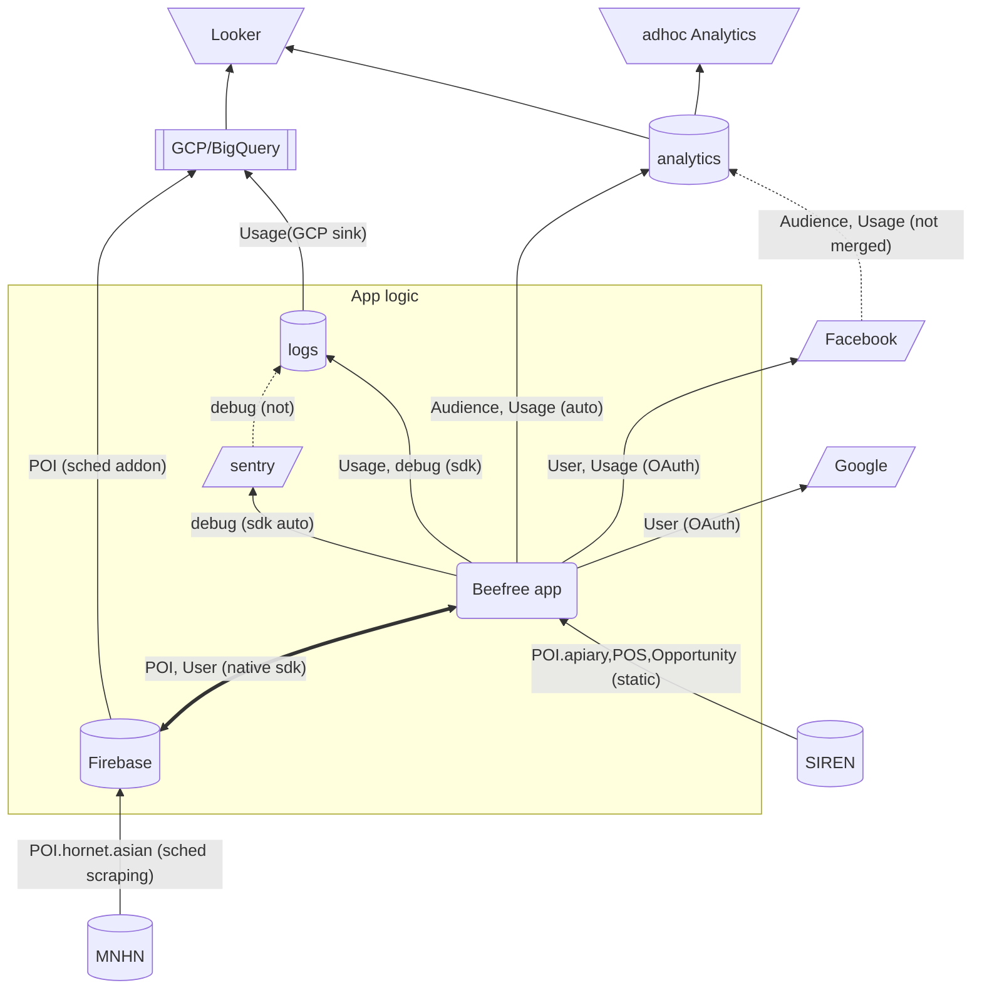

# Data pipelines High Level Overview

```mermaid
flowchart BT
    mnhn[(MNHN)]
	siren[(SIREN)]
    ana[(analytics)]
	log[(logs)]
	app(Beefree app)
	bq[[GCP/BigQuery]]
    fb[/Facebook/]
    ggl[/Google/]
    lkr[\Looker/]
    firebase[(Firebase)]

    subgraph "App logic"
		firebase <==POI, User (native sdk) ==> app
		stry[/sentry/] -.debug (not).-> log
		app --debug (sdk auto)--> stry
        app --Usage, debug (sdk)--> log
	end
	mnhn --POI.hornet.asian (sched scraping) --> firebase
	siren --POI.apiary,POS,Opportunity (static) --> app
	firebase --POI (sched addon) --> bq
	log --Usage(GCP sink)--> bq
	app --Audience, Usage (auto)--> ana
	fb -.Audience, Usage (not merged).-> ana
	app --User, Usage (OAuth)--> fb
    app --User (OAuth)--> ggl
    ggl ~~~ fb
	bq --> lkr
    ana --> lkr
  	ana --> ga[\adhoc Analytics/]
```

